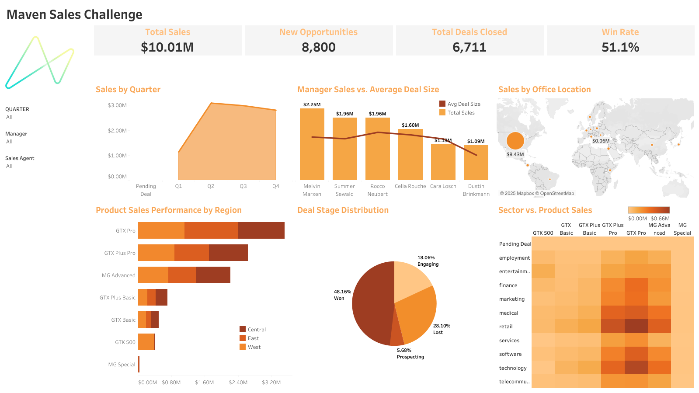

# Maven-sales-challenge
### Challenge Objective 🎯
For the Maven Sales Challenge, you'll play the role of a BI Developer for **MavenTech**, a company that specializes in selling computer hardware to large businesses. They've been using a new CRM system to track their sales opportunities but have no visibility of the data outside of the platform.

In an effort to become a data-driven organization, you've been asked to create an interactive dashboard that enables sales managers to track their team's quarterly performance.

### About The Dataset 📊
The data contains B2B sales opportunities from a CRM database for a fictitious company that sells computer hardware, including information on accounts, products, sales teams, and sales opportunities. This dataset provides insights into how the sales teams are performing, what products are being sold, and how they are progressing through the sales pipeline.

### Files Included 📂:
- **`create_tables.sql`**: SQL script to create the necessary tables for the project.
- **`clean_tables.sql`**: SQL script to clean and prepare the data for analysis.
- **`combine_tables.sql`**: SQL script to combine the necessary tables into a unified dataset for analysis.
- **`Maven_sales_challenge.twbx`**: Tableau packaged workbook that contains the visualizations created for the dashboard.
- **`dashboard.png`**: Image file of the final Tableau dashboard.
  

### Data Source 🌐
You can download the dataset used for this analysis from [here](https://mavenanalytics.io/challenges/maven-sales-challenge/8f59bcfa-d310-4947-b3d8-917b3cce270e). 

### Tools Used 🛠️:
- **SQL with PostgreSQL**: Data cleaning, transformation, and preparation were done using SQL scripts in **PostgreSQL**, managed via **pgAdmin**. 
- **Tableau Public**: Visualizations were created in Tableau Public, showcasing interactive dashboards. The final workbook was saved as a `.twbx` file for sharing.

### View the Dashboard 👀:
You can interact with the visualizations by visiting my Tableau Public profile and viewing the dashboard at this link: [View the Interactive Dashboard on Tableau Public](https://public.tableau.com/app/profile/nafsika.kalogeropoulou/viz/Maven_Sales_Challenge/Dashboard1).

Alternatively, here is a screenshot of the final dashboard:

